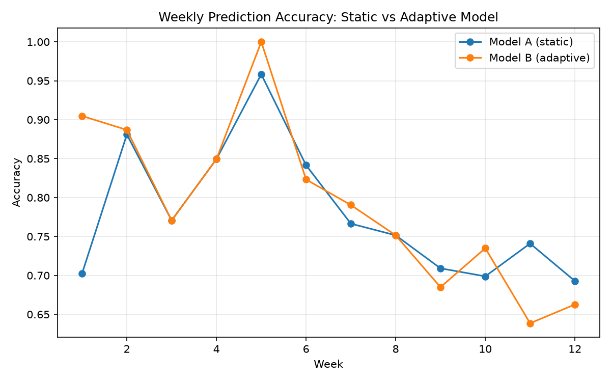
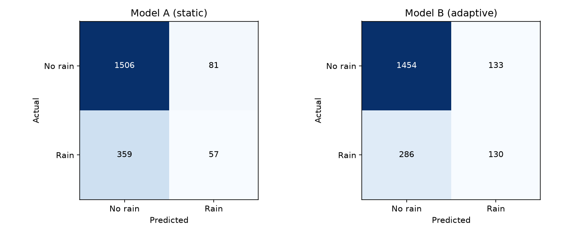

# Localized AI Weather Prediction with Adaptive Online Learning

Adaptive machine learning pipeline for localized rainfall prediction using a custom ESP32 weather station.

This repository documents the design, implementation, and evaluation of a low-cost weather station that investigates whether **adaptive online learning** can outperform a traditional **static machine learning model** for localized rainfall prediction. The project combines embedded systems, data collection, machine learning, and statistical analysis into a complete end-to-end research workflow.

---

## Overview

Traditional weather prediction models are typically trained once using historical regional data and remain unchanged after deployment. While this approach performs well at large geographic scales, it often struggles to capture localized weather patterns that develop over time.

This project explores a different approach.

Instead of relying exclusively on historical data, a second machine learning model continuously retrains using newly collected observations from a custom-built weather station. The objective is to determine whether continual adaptation improves rainfall prediction while maintaining comparable overall accuracy.

Both models were evaluated using the same twelve-week deployment and identical environmental observations.

---

## Research Question

> **Can an adaptive machine learning model that retrains on localized weather observations outperform a traditional static model trained only on historical regional data?**

---

## Project Summary

| Category | Value |
|-----------|-------|
| Timeline | January–August 2026 |
| Deployment Length | 12 Weeks |
| Logged Data | 2,003 Hours |
| Rain Events | 416 Hours |
| Hardware Platform | ESP32 |
| Sensors | Temperature, Humidity, Pressure, Rainfall |
| Machine Learning | Random Forest |
| Primary Metric | Rainfall F1 Score |
| Hardware Cost | <$150 |

---

## Results at a Glance

The adaptive model maintained nearly identical overall accuracy while substantially improving rainfall detection.

| Model | Accuracy | Precision | Recall | Rain F1 |
|------|---------:|----------:|-------:|--------:|
| Majority Baseline | **79.23%** | — | — | — |
| Static Random Forest | 78.03% | 41.30% | 13.70% | 0.206 |
| Adaptive Random Forest | **79.08%** | **49.43%** | **31.25%** | **0.383** |

The adaptive model improved rainfall F1-score by approximately **86%** compared to the static baseline while maintaining virtually identical overall accuracy.

Rather than increasing overall accuracy alone, the adaptive model became significantly better at identifying actual rainfall events, making it more useful for practical forecasting.

---

# System Architecture

The project consists of four primary stages:

1. Environmental data collection
2. Feature engineering
3. Machine learning prediction
4. Statistical evaluation

```text
                     Weather Station

        ┌─────────────────────────────┐
        │            ESP32            │
        └─────────────────────────────┘
            ▲        ▲         ▲
            │        │         │
        BME280   Rain Gauge   SD Card

                    │
                    ▼

          Feature Engineering
     • Cleaning
     • Lag Variables
     • Validation
     • Dataset Generation

              ┌──────────────┐
              │              │
              ▼              ▼

     Model A (Static)   Model B (Adaptive)

              └──────┬───────┘
                     ▼

        Statistical Evaluation
```

The ESP32 samples weather conditions every five minutes and stores each observation locally on a microSD card. After deployment, the collected data is processed through a feature engineering pipeline before being evaluated by two separate Random Forest classifiers.

The static model remains unchanged throughout the experiment, while the adaptive model retrains weekly using newly collected local observations.

---

# Hardware

The weather station was designed to provide continuous outdoor monitoring while remaining inexpensive enough to be reproduced by students and hobbyists.

| Component | Purpose |
|-----------|---------|
| ESP32 | Main microcontroller |
| BME280 | Temperature, humidity, and pressure sensing |
| Tipping Bucket Rain Gauge | Rainfall measurement |
| MicroSD Module | Local data storage |
| 32 GB SD Card | Dataset logging |
| Weatherproof Enclosure | Outdoor deployment |
| Power Supply | Continuous operation |

Total hardware cost remained below **$150**.

---

# Software Pipeline

The analysis pipeline was developed entirely in Python.

| Library | Purpose |
|---------|---------|
| Pandas | Data processing |
| NumPy | Numerical computation |
| Scikit-Learn | Machine learning |
| SciPy | Statistical analysis |
| Matplotlib | Visualization |

Before training either model, the raw sensor data undergoes several preprocessing steps:

- Missing value handling
- Sensor validation
- Temporal feature engineering
- Lag variable generation
- Rainfall clipping
- Dataset formatting

These engineered features are then supplied to both machine learning models under identical conditions.

---
# Machine Learning Methodology

## Model A — Static Random Forest

The baseline model is a conventional Random Forest classifier trained once using historical regional weather observations. After training, the model remains fixed throughout the deployment and never incorporates newly collected environmental data.

This approach represents the workflow used by many traditional machine learning systems, where models are periodically retrained offline rather than continuously adapting after deployment.

---

## Model B — Adaptive Random Forest

The adaptive model begins with the same initialization and hyperparameters as the static model but incorporates localized observations collected during deployment.

At the end of each week, newly collected data is validated, processed, and merged into the training dataset. To encourage adaptation without completely forgetting historical information, recent observations receive increased weighting during retraining.

This process allows the model to gradually learn environmental characteristics unique to the deployment location while preserving knowledge from the original training dataset.

---

## Feature Engineering

Raw sensor readings alone often contain insufficient information for accurate rainfall prediction. To better capture evolving weather patterns, additional features are generated before model training.

The preprocessing pipeline includes:

- Data validation and cleaning
- Missing value handling
- Rainfall clipping to remove sensor anomalies
- One-, two-, and three-hour lag variables
- Pressure trend calculations
- Dataset normalization and formatting

These engineered features allow both models to recognize gradual atmospheric changes that frequently precede rainfall.

---

# Experimental Results

The weather station operated continuously for twelve weeks, collecting over **2,000 hours** of environmental observations. Because approximately 80% of recorded hours were dry, overall accuracy alone is not an informative evaluation metric.

Instead, rainfall **Precision**, **Recall**, and **F1 Score** are emphasized throughout this analysis.

## Overall Performance

| Model | Accuracy | Precision | Recall | Rain F1 |
|------|---------:|----------:|-------:|--------:|
| Majority Baseline | **79.23%** | — | — | — |
| Static Random Forest | 78.03% | 41.30% | 13.70% | 0.206 |
| Adaptive Random Forest | **79.08%** | **49.43%** | **31.25%** | **0.383** |

Although both models achieved nearly identical overall accuracy, the adaptive model detected substantially more rainfall events while also improving prediction precision.

The resulting **86% improvement in Rain F1 Score** represents the primary finding of this project.

---

## Weekly Performance

<p align="center">

</p>

<p align="center">
<b>Figure 1.</b> Weekly prediction accuracy of the static and adaptive models throughout the twelve-week deployment.
</p>

Both models began with identical training data and therefore similar predictive performance. As additional localized observations became available, the adaptive model gradually diverged from the static baseline, learning weather patterns specific to Carmel's coastal environment.

Although weekly accuracy fluctuated due to changing weather conditions, the adaptive model generally maintained comparable or improved performance throughout the deployment.

---

## Confusion Matrix Comparison

<p align="center">

</p>

<p align="center">
<b>Figure 2.</b> Confusion matrices for the static and adaptive Random Forest classifiers.
</p>

The confusion matrices illustrate the primary difference between the two models.

The adaptive model correctly identified **130 rainfall observations**, compared to only **57** detected by the static model. This improvement came with a modest increase in false positives, reflecting a deliberate shift toward greater rainfall sensitivity.

For practical forecasting, this tradeoff is often preferable to simply maximizing overall classification accuracy.

---

## Weekly Model Comparison

Weekly performance highlights how the adaptive model evolved throughout deployment.

| Week | Static Accuracy | Adaptive Accuracy | Difference |
|------:|---------------:|------------------:|-----------:|
| 1 | 70.24% | **90.48%** | +20.24% |
| 2 | 88.10% | **88.69%** | +0.60% |
| 3 | 77.06% | 77.06% | 0.00% |
| 4 | 84.94% | 84.94% | 0.00% |
| 5 | 95.83% | **100.00%** | +4.17% |
| 6 | **84.15%** | 82.32% | −1.83% |
| 7 | 76.65% | **79.04%** | +2.40% |
| 8 | 75.15% | 75.15% | 0.00% |
| 9 | **70.91%** | 68.48% | −2.42% |
| 10 | 69.88% | **73.49%** | +3.61% |
| 11 | **74.10%** | 63.86% | −10.24% |
| 12 | **69.28%** | 66.27% | −3.01% |

The adaptive model showed its largest improvement during the first week of deployment before gradually converging toward the static model. Toward the end of the deployment, rapidly changing seasonal conditions temporarily reduced the adaptive model's advantage, highlighting one of the primary challenges of online learning systems.

---

# Statistical Analysis

Overall accuracy improvements were evaluated using three complementary statistical methods.

| Test | Purpose |
|------|---------|
| McNemar's Test | Compare paired prediction accuracy |
| Bootstrap Confidence Interval | Estimate uncertainty in accuracy improvement |
| Weekly Paired t-Test | Evaluate consistency across deployment weeks |

Together, these tests assess whether observed performance differences are statistically meaningful rather than the result of random variation.

---
## Statistical Results

Three complementary statistical tests were performed to determine whether the observed performance differences between the two models were statistically significant.

### McNemar's Test

McNemar's test compares the paired predictions made by both classifiers on identical observations.

| Statistic | Value |
|----------|------:|
| A Correct / B Incorrect | 80 |
| A Incorrect / B Correct | 101 |
| p-value | 0.1369 |

At a significance level of α = 0.05, the null hypothesis cannot be rejected. Although the adaptive model produced more correct predictions overall, the improvement in overall accuracy is not statistically significant.

---

### Bootstrap Confidence Interval

A bootstrap analysis was performed to estimate uncertainty in overall accuracy.

| Metric | Value |
|--------|------:|
| Mean Accuracy Difference | +1.05% |
| 95% Confidence Interval | [-0.25%, +2.40%] |

Because the confidence interval contains zero, the true improvement in overall accuracy cannot be established with statistical confidence.

---

### Weekly Paired t-Test

Weekly model performance was also evaluated using a paired t-test.

| Statistic | Value |
|----------|------:|
| Mean Weekly Difference | +1.13% |
| t-statistic | 0.549 |
| p-value | 0.5938 |

Weekly accuracy varied substantially throughout deployment, resulting in no statistically significant difference in overall weekly accuracy.

---

# Discussion

The primary objective of this project was not simply to maximize classification accuracy, but to determine whether adaptive online learning could improve localized rainfall prediction.

Although the adaptive model produced only a modest increase in overall accuracy, it consistently detected substantially more rainfall events than the static baseline. Rainfall recall increased from **13.7%** to **31.3%**, while Rain F1 Score improved from **0.206** to **0.383**, representing an improvement of approximately **86%**.

For highly imbalanced weather datasets, these improvements are more meaningful than small changes in overall accuracy. A classifier that predicts "no rain" for every observation achieves high accuracy but provides little practical value. The adaptive model instead traded a small increase in false positives for a much larger improvement in rainfall detection.

The deployment also highlighted practical engineering challenges associated with adaptive machine learning. During Week 5, a mechanical obstruction in the tipping-bucket rain gauge produced invalid rainfall measurements. Rather than incorporating corrupted observations into the training process, the affected data was excluded from subsequent retraining. This prevented the adaptive model from learning incorrect relationships and emphasized the importance of data validation in real-world autonomous systems.

Finally, the adaptive model's advantage decreased during the final weeks of deployment as weather patterns changed. This suggests that while continual retraining allows a model to adapt to local conditions, it also introduces sensitivity to sudden distribution shifts. Future adaptive systems should balance responsiveness to new observations with long-term model stability.

Overall, this project demonstrates that adaptive online learning can substantially improve rainfall detection using inexpensive embedded hardware while maintaining comparable overall prediction accuracy.

---

# Repository Structure

```text
AI-Weather-Prediction/
│
├── hardware/
│   ├── firmware/
│   ├── wiring/
│   └── enclosure/
│
├── data/
│   ├── raw/
│   └── processed/
│
├── python/
│   ├── online_pipeline/
│   └── analysis/
│       ├── data_analysis.py
│       ├── weekly_results.csv
│       ├── results_summary.csv
│       └── plots/
│           ├── weekly_accuracy_trend.png
│           └── confusion_matrices.png
│
└── README.md
```

---

# Reproducing the Results

Clone the repository.

```bash
git clone https://github.com/yourusername/localized-weather-ai.git
```

Install the required Python libraries.

```bash
pip install numpy pandas matplotlib scipy scikit-learn
```

Run the analysis pipeline.

```bash
python python/analysis/data_analysis.py
```

The analysis script generates:

- Performance summary tables
- Weekly evaluation metrics
- Confusion matrices
- Weekly accuracy visualizations
- Statistical significance tests

---

# Project Scope

This repository documents the complete workflow for designing, deploying, and evaluating an adaptive machine learning system for localized rainfall prediction. It includes hardware design, data collection, feature engineering, model training, statistical evaluation, and visualization of experimental results.

The emphasis of this project is not solely on predictive performance, but on developing a reproducible framework for evaluating adaptive learning strategies on resource-constrained embedded systems operating in real-world environments.
