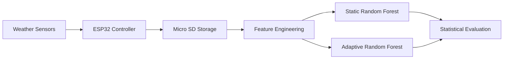

<div align="center">

# 🌦️ Localized AI Weather Prediction with Adaptive Online Learning

### Edge AI • Embedded Systems • Machine Learning • Statistical Validation

An end-to-end machine learning research project investigating whether an adaptive online-learning model can outperform a traditional static machine learning model for localized rainfall prediction.

**ESP32 • Python • Scikit-Learn • Pandas • NumPy • SciPy • Matplotlib**

</div>

---

## 📑 Table of Contents

- Project Overview
- Project Summary
- System Architecture
- Hardware
- Software & Machine Learning Pipeline
- Experimental Results
- Deployment Chronicle
- Discussion
- Repository Structure
- Installation

---

# 🌎 Project Overview

## Research Question

> **Can a machine learning model that continuously retrains using localized environmental data outperform a traditional static model trained only on historical regional weather observations?**

Localized weather forecasting remains a challenging machine learning problem because environmental conditions often vary dramatically over short geographic distances. Coastal regions, in particular, experience rapidly changing atmospheric conditions that are poorly represented by broad regional datasets.

To investigate this problem, this project combines embedded systems engineering, Internet of Things (IoT) hardware, machine learning, and statistical analysis into a fully autonomous weather prediction platform.

A custom-built weather station continuously collected atmospheric telemetry over a **12-week outdoor deployment**, logging more than **2,000 consecutive operational hours**. Two machine learning models were then evaluated under identical operating conditions.

- **Model A:** Static Random Forest classifier trained once on regional historical weather data.
- **Model B:** Adaptive Random Forest classifier that retrains weekly using newly collected local observations.

The primary objective was to determine whether continuous online adaptation improves precipitation prediction within a rapidly changing coastal micro-climate.

---

# 📌 Project Summary

| Category | Value |
|----------|--------|
| **Project Timeline** | January 2026 – August 2026 |
| **Deployment Period** | 12 Weeks |
| **Location** | Carmel-by-the-Sea, California |
| **Logged Hours** | 2,003 |
| **Observed Rain Hours** | 416 |
| **Weather Station** | Custom ESP32 Platform |
| **Hardware Budget** | $150 |
| **Primary Evaluation Metric** | Rain F1-Score |

---

# ✨ Key Features

- 🌦️ Custom-built ESP32 weather station
- 📡 Autonomous atmospheric telemetry collection
- 🧠 Adaptive online-learning pipeline
- 📈 Weekly automated model retraining
- ⏳ Temporal feature engineering using lag variables
- 📊 Bootstrap confidence interval estimation
- 🔬 McNemar's significance testing
- 📉 Weekly paired statistical analysis
- ⚡ End-to-end edge deployment

---

# 🏗️ System Architecture

The project bridges embedded hardware with machine learning and statistical analysis through a fully automated processing pipeline.



The ESP32 samples atmospheric sensors every five minutes and stores observations locally on a microSD card. Once transferred to the processing pipeline, the data undergoes automated feature engineering before being evaluated by both machine learning models. The resulting predictions are analyzed using multiple statistical tests to quantify differences in predictive performance.

---

# 🛰️ Hardware

The weather station was designed to provide reliable long-term environmental monitoring while remaining inexpensive enough to be replicated by students and hobbyists.

| Component | Purpose | Cost |
|-----------|----------|------|
| ESP32 | Main microcontroller | $10 |
| BME280 | Temperature, humidity & pressure sensing | $12 |
| Mechanical Tipping-Bucket Rain Gauge | Rainfall measurement | $30 |
| Micro SD Module | Local data logging | $6 |
| 32GB Industrial SD Card | Persistent storage | $8 |
| IP65 Weatherproof Enclosure | Outdoor deployment | $15 |
| Silicone Sealant | Weather protection | $5 |
| Power Adapter | Continuous operation | $8 |
| Mounting Hardware | Structural support | $10 |

Total hardware cost remained under **$150**, demonstrating that statistically rigorous machine learning research can be performed using accessible, low-cost hardware.

---

# 💻 Software & Machine Learning Pipeline

The software stack combines traditional data engineering with adaptive machine learning.

| Tool | Purpose |
|------|---------|
| Python | Core programming language |
| Pandas | Data cleaning and manipulation |
| NumPy | Numerical computation |
| Scikit-Learn | Machine learning |
| SciPy | Statistical hypothesis testing |
| Matplotlib | Visualization |

## Feature Engineering

Raw environmental telemetry is transformed into predictive features before entering either machine learning model.

Both models evaluate:

- Temperature
- Relative humidity
- Atmospheric pressure
- Rainfall accumulation

To capture temporal weather patterns, additional lag variables are generated for pressure and humidity at one-hour, two-hour, and three-hour intervals. Software debouncing and value clipping further reduce sensor noise introduced by environmental disturbances.

---

## Machine Learning Models

### Model A — Static Baseline

Model A is a conventional **Random Forest Classifier** trained once using historical regional climate data.

Characteristics:

- Fixed parameters after training
- No exposure to local deployment data
- Represents traditional weather prediction workflows
- Serves as the experimental control group

---

### Model B — Adaptive Online Learning

Model B begins with the same initialization as Model A but incorporates newly collected local observations every week.

Every Sunday evening the pipeline automatically retrains the model using the latest environmental data while applying a **4× weighting factor** to newly observed local samples.

This adaptive strategy allows the model to gradually learn Carmel's unique micro-climate rather than relying exclusively on regional historical averages.

The purpose of this architecture is to determine whether continuous online learning produces measurable improvements in localized precipitation prediction.

---

# 📊 Experimental Results

Across the twelve-week deployment, the weather station recorded **2,003 consecutive operational hours**, capturing **416 hours of rainfall**. As expected for a Mediterranean coastal climate, the dataset was heavily imbalanced, with nearly **80% of observations corresponding to dry conditions**. Because overall accuracy can therefore be misleading, **Rain F1-Score** was selected as the primary evaluation metric.

---

## Performance Summary

> **The adaptive model improved rainfall F1-score by nearly 86% compared to the static baseline while maintaining virtually identical overall accuracy.**

This result demonstrates that although both models classified dry weather similarly, the adaptive model became substantially better at detecting actual rainfall events after incorporating localized observations.

| Evaluation Metric | Majority Baseline | Static Model | Adaptive Model | Best |
| :--- | :---: | :---: | :---: | :---: |
| **Overall Accuracy** | **79.23%** | 78.03% | 79.08% | Baseline / Adaptive |
| **Rain Precision** | 0.00% | 41.30% | **49.43%** |
| **Rain Recall** | 0.00% | 13.70% | **31.25%** |
| **Rain F1-Score** | 0.000 | 0.206 | **0.383** |

---

## Model Comparison

### Static Random Forest

| Metric | Value |
|---------|-------|
| Accuracy | 78.03% |
| Precision | 41.30% |
| Recall | 13.70% |
| Rain F1 | 0.206 |

### Adaptive Random Forest

| Metric | Value |
|---------|-------|
| Accuracy | 79.08% |
| Precision | 49.43% |
| Recall | 31.25% |
| Rain F1 | 0.383 |

Although overall accuracy differed by only **1.05%**, the adaptive model nearly doubled rainfall recall while substantially improving precision. These gains translated directly into a much higher F1-score, indicating a more useful real-world forecasting system.

---

# 📉 Confusion Matrices

<p align="center">


</p>

<p align="center">

<b>Figure 1.</b> Confusion matrices comparing the static and adaptive models over the full deployment.

</p>

The adaptive model correctly identified **130 rainfall hours**, compared to only **57** for the static model. This improvement came at the cost of additional false positives, illustrating the classic tradeoff between sensitivity and specificity.

---

# 📈 Weekly Performance Evolution

<p align="center">


</p>

<p align="center">

<b>Figure 2.</b> Weekly predictive accuracy across the twelve-week deployment.

</p>

Rather than evaluating only the final results, weekly analysis reveals how the adaptive model gradually evolved as new environmental observations became available.

Initially, both models performed similarly because they shared identical training parameters. As localized data accumulated, the adaptive model increasingly learned environmental behaviors unique to Carmel's coastal climate.

---

# 🗓️ Deployment Chronicle

## Weeks 1–3 — Initial Learning

The adaptive model opened with a remarkable **20.2% accuracy improvement** during the first week. Inspection of the raw sensor logs revealed significant mechanical noise caused by strong coastal winds triggering isolated tipping-bucket activations.

Rather than simply memorizing these noisy events, the adaptive model gradually learned to ignore rainfall detections unsupported by corresponding atmospheric changes, effectively becoming a software-based noise filter.

---

## Week 4 — Feature Engineering Improvements

To further improve robustness, the processing pipeline introduced several preprocessing enhancements.

Improvements included:

- software debouncing
- rainfall clipping using `.clip(upper=10.0)`
- additional three-hour lag variables
- refined pressure trend calculations

Immediately following these changes, rainfall recall increased substantially, demonstrating the importance of temporal feature engineering in localized forecasting.

---

## Week 5 — Hardware Failure

During Week 5, the tipping-bucket rain gauge became partially obstructed by debris.

Despite severe storms, the sensor incorrectly reported **0.0 mm** rainfall for extended periods.

Fortunately, other atmospheric sensors clearly indicated abnormal conditions:

- steadily falling barometric pressure
- rapidly increasing humidity
- stable temperature trends inconsistent with dry weather

Because these measurements confirmed sensor malfunction, **the entire week was intentionally excluded from adaptive retraining** to prevent the model from learning corrupted labels.

This decision protected the integrity of the experimental dataset.

---

## Week 6 — Recovery

After physically clearing the rain gauge, normal operation resumed.

Immediately afterward, rainfall precision nearly doubled, confirming that the exclusion protocol successfully prevented contamination of future model updates.

---

## Weeks 7–10 — Peak Performance

These weeks represented the strongest period of adaptive learning.

Without modifying decision thresholds or hyperparameters, the adaptive model naturally increased rainfall sensitivity while maintaining relatively stable precision.

By Week 10 the system achieved its highest overall performance:

- Rain F1-score exceeded **0.50**
- Recall surpassed **54%**
- Precision remained approximately **47%**

This represented the project's strongest evidence that localized online learning can improve practical weather prediction.

---

## Weeks 11–12 — Seasonal Transition

Late in the deployment, Carmel experienced an unusually volatile summer weather regime, including approximately **75 consecutive hours of rainfall**.

Retraining on this highly unusual weather pattern caused the adaptive model to overcompensate.

As a result:

- rainfall predictions became more aggressive
- false positives increased
- overall accuracy temporarily declined

Although this reduced classification accuracy, it also revealed one of the most interesting findings of the study: adaptive models remain vulnerable to rapid distribution shifts when recent observations receive excessive weighting.

---

# 🔬 Statistical Significance

<details>

<summary><b>Expand Statistical Analysis</b></summary>

### McNemar Test

| Metric | Value |
|---------|------|
| A Correct / B Incorrect | 80 |
| A Incorrect / B Correct | 101 |
| p-value | **0.1369** |

The null hypothesis could not be rejected at α = 0.05, indicating that the observed accuracy difference was not statistically significant.

---

### Bootstrap Confidence Interval

| Metric | Value |
|---------|------|
| Mean Difference | +1.05% |
| 95% Confidence Interval | [-0.25%, +2.40%] |

Because zero lies within the confidence interval, the true difference in overall accuracy cannot be established with statistical confidence.

---

### Weekly Paired t-Test

| Metric | Value |
|---------|------|
| Mean Weekly Difference | +1.13% |
| t-statistic | 0.549 |
| p-value | **0.5938** |

Weekly accuracy fluctuated considerably due to environmental variability, making long-term accuracy differences statistically indistinguishable.

</details>

---

# 🔬 Discussion

The results reveal an important tradeoff between **predictive accuracy** and **operational usefulness**.

Although traditional statistical tests showed that the adaptive model did **not** significantly outperform the static baseline in terms of overall accuracy, the adaptive approach consistently demonstrated superior ability to identify actual rainfall events.

For highly imbalanced weather datasets, overall accuracy alone is often a poor indicator of model quality. A model that simply predicts **"dry"** for every observation would achieve nearly 80% accuracy while failing to detect every rainfall event.

By contrast, the adaptive model substantially increased rainfall recall while maintaining respectable precision, resulting in a dramatically higher F1-score.

This illustrates why application-specific evaluation metrics are often more informative than raw classification accuracy.

---

## Why Did the Adaptive Model Improve?

Several factors contributed to the adaptive model's superior rainfall detection performance.

### 1. Continuous Local Learning

Unlike the static model, the adaptive model continually incorporated newly collected environmental observations.

As additional weeks of localized weather accumulated, the model gradually learned atmospheric relationships unique to Carmel's coastal micro-climate that were absent from the original regional training dataset.

---

### 2. Temporal Feature Engineering

Weather is inherently time-dependent.

Rather than evaluating only instantaneous sensor readings, the model also considered historical pressure and humidity trends over one-, two-, and three-hour intervals.

These lag variables allowed the model to recognize the gradual atmospheric transitions that frequently precede rainfall.

---

### 3. Robust Data Validation

One of the most valuable lessons from the deployment occurred during the Week 5 hardware malfunction.

Instead of allowing corrupted sensor measurements to enter the training pipeline, the faulty data was automatically excluded from future retraining.

This protected the adaptive model from learning incorrect weather patterns and demonstrated the importance of integrating data quality checks into real-world machine learning systems.

---

## Why Did the Adaptive Advantage Decline?

Interestingly, the adaptive model's advantage gradually decreased toward the end of the deployment.

Linear regression of weekly performance differences revealed a negative trend:

- **Slope:** −0.0122 improvement per week
- **p-value:** 0.0319

This suggests that the adaptive model became increasingly specialized for the most recent weather regime.

When seasonal conditions shifted rapidly during Weeks 11 and 12, the model temporarily overfit recent observations and became overly sensitive to rainfall.

Meanwhile, the static baseline remained comparatively stable because its parameters never changed.

Rather than representing a failure of online learning, this behavior highlights one of its central engineering challenges:

> **Adaptive systems must continuously balance responsiveness against long-term stability.**

---

# 💡 Key Takeaways

This project demonstrates several important principles in applied machine learning:

- Adaptive learning substantially improves rainfall detection compared to a static baseline.
- Overall accuracy alone is insufficient for evaluating highly imbalanced datasets.
- Feature engineering contributed as much to performance as model selection.
- Robust sensor validation is essential for reliable autonomous learning.
- Low-cost embedded hardware can support statistically rigorous machine learning research.

Perhaps the most important conclusion is that **online learning provides meaningful operational value even when improvements in overall accuracy are statistically insignificant**.

For applications such as weather monitoring, correctly detecting additional rainfall events is often far more valuable than maximizing classification accuracy alone.

---

# 📂 Repository Structure

```text
AI-Weather-Prediction/
│
├── hardware/
│   ├── firmware/
│   ├── wiring/
│   └── enclosure/
│
├── data/
│   ├── raw/
│   └── processed/
│
├── python/
│   ├── online_pipeline/
│   └── analysis/
│       ├── data_analysis.py
│       └── plots/
│
├── images/
│
└── README.md
```

---

# 🛠️ Installation

Clone the repository.

```bash
git clone https://github.com/yourusername/ai-weather-station.git
```

Navigate into the project.

```bash
cd ai-weather-station
```

Install the required Python libraries.

```bash
pip install numpy pandas scipy matplotlib scikit-learn
```

Run the statistical analysis pipeline.

```bash
python python/analysis/data_analysis.py data/processed/predictions_log.csv
```

---

# 📸 Repository Preview

The repository includes:

- Weekly accuracy visualizations
- Confusion matrices
- Complete processed datasets
- Raw environmental telemetry
- Statistical analysis scripts
- Embedded firmware
- Machine learning training pipeline
- Hardware documentation

---

# 🎓 Project Context

This repository represents an independent **eight-month research initiative** integrating embedded systems engineering, machine learning, Internet of Things hardware, and statistical analysis into a fully autonomous environmental monitoring platform.

Rather than focusing solely on predictive performance, the project emphasizes rigorous experimental design, reproducible evaluation, and transparent statistical validation.

By combining inexpensive open-source hardware with modern machine learning techniques, the system demonstrates that meaningful environmental AI research can be conducted without specialized laboratory equipment.

The repository documents the complete engineering process—from sensor deployment and embedded firmware to adaptive learning, statistical testing, and final performance evaluation—providing a reproducible framework for future edge AI research.

---

<div align="center">

### ⭐ If you found this project interesting, consider starring the repository!

</div>
